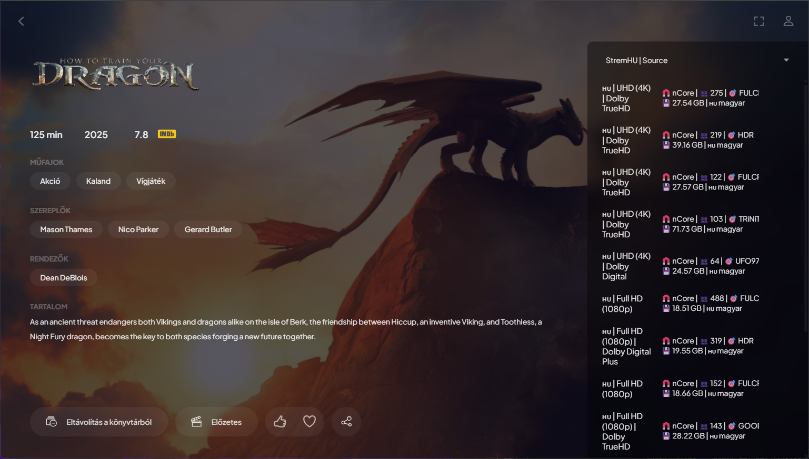

## StremHU | Source

Self-hostolható Stremio addon, amellyel **közvetlenül magyar trackeroldalakról** streamelhetsz.

> [!NOTE]
> Ez egy szabadidős projekt! Hibajelentéseket és fejlesztési ötleteket szívesen fogadok kulturáltan "issue"-k formájában.

### Támogatott trackerek

- **nCore**
- **BitHUmen**
- **Majomparádé**

> [!CAUTION]
> A Majomparádé Hit'n'Run szabályzata szerint a teljes torrentet le kell tölteni. **A StremHU | Source NEM tölti le a teljes torrentet!**

### Funkciók

- **Self-host** Dockerrel – távolról is elérheted, és streamelhetsz róla.
- **Automatikus seeding** a lejátszás után; opcionálisan **Hit’n’Run figyelés**, teljesítés után törlés.
- **Felhasználókezelés** – mindenki saját preferenciákkal használhatja az addont Stremio-ban, anélkül hogy megosztanád a tracker-hozzáférést.
- **Helyi hálózaton automatikus HTTPS** támogatás.

> [!TIP]
> Ajánlott futtatási környezet: 24/7 elérhető gép (pl. NAS).

### Követelmények

- Érvényes fiók a támogatott tracker(ek)hez.
- Elég tárhely a letöltésekhez.
- Docker + Docker Compose.
- Távoli eléréshez saját domain (ajánlott) és megfelelő hálózati beállítások.

### StremHU | Source beüzemelési segédletek

- [StremHU | Source beüzemelése otthon](./docs/stremhu-source-beuzemelese-otthon.md)
- [StremHU | Source elérése az internetről](./docs/stremhu-source-elerese-az-internetrol.md)
- [Docker Compose beállítási lehetőségek](./docs/docker-compose-beallitasi-lehetosegek.md)

### GYIK

- **Mi az a [Stremio](https://www.stremio.com/)?**
  - Streaming alkalmazás, amely addonokon keresztül ér el különböző tartalomforrásokat.
- **Mi ez az addon?**
  - Egy magyar trackeroldalakat „megszólító” kiegészítő, amely a találatokat Stremio‑kompatibilis módon jeleníti meg, és biztosítja a letöltés/seedelés/streamelés folyamatát.
